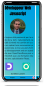

# 
GillesLaurant.fr

    

## 
Description

Redesign of my portfolio in javascript in PWA with sending emails, theme management (Dark / Light) and language management (Fr / En).

The application is visible at **_[GillesLaurant.fr](https://gilleslaurant.fr)_**

    

